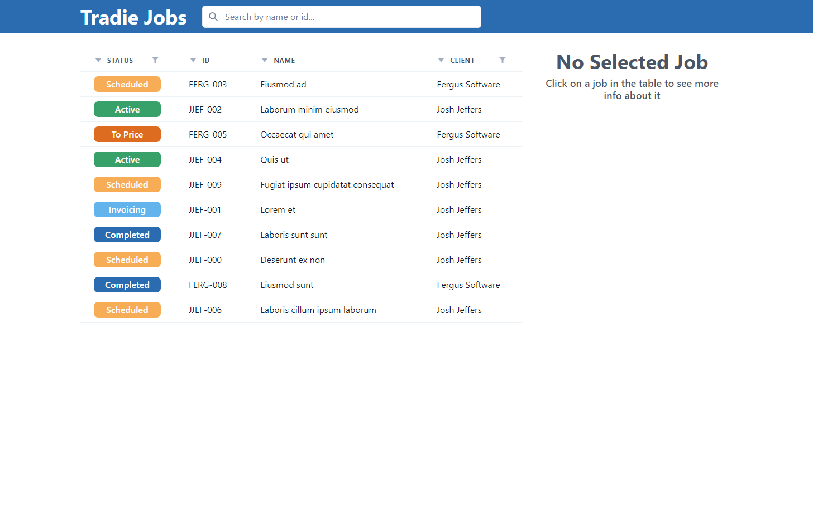
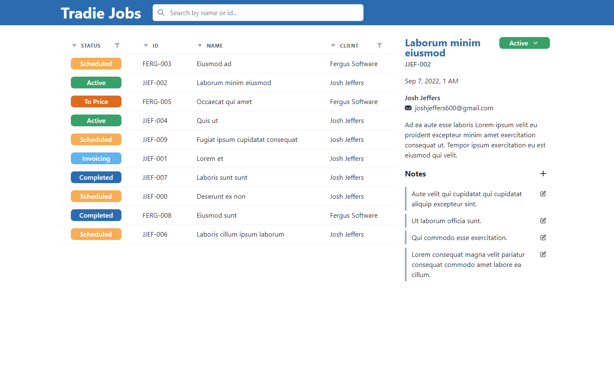
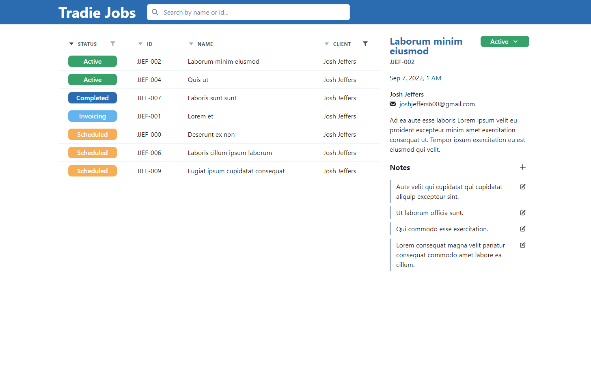
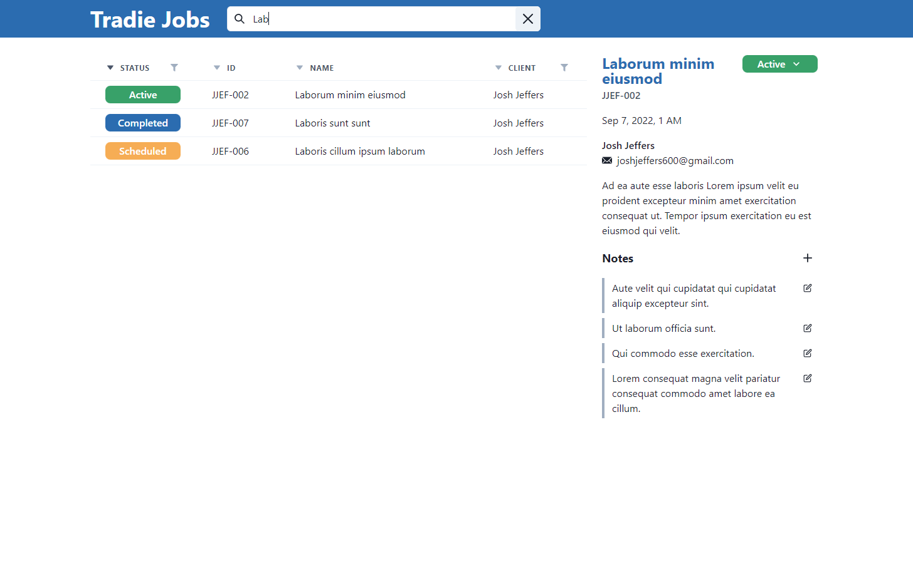
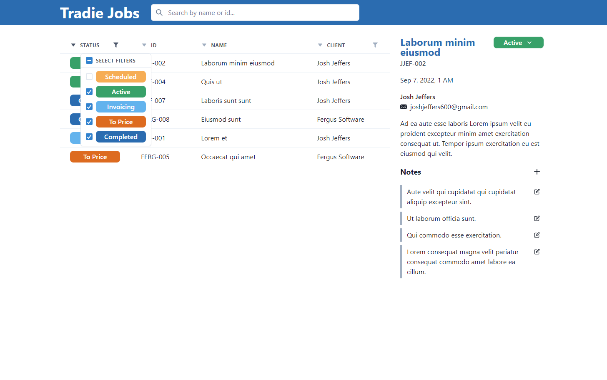
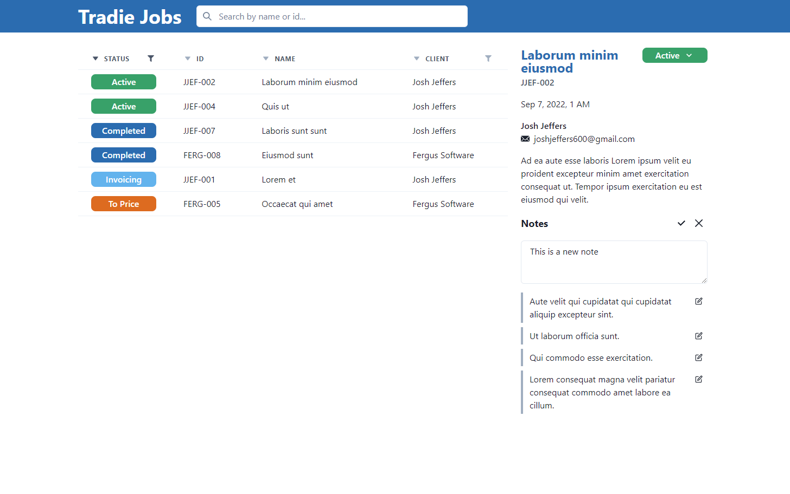

# Tradie Jobs 

The frontend for a job management web application that enables tradies to view jobs, add/edit notes and filter/sort the jobs. This was designed as part of the Fergus frontend technical assessment.

In this project, the filtering/sorting displayed in the `JobTable` is a fully functional custom built data-table using Chakra UI for the visuals and Redux for the state management.

The UI is populated using 10 randomly generated jobs. These jobs will be regenerated if you refresh the page.

## Tech stack

<div align="center">


</div>

## Installation

It is recommended that you run this website using yarn. You can install it using: `npm i -g yarn`.

After cloning the repository, you can start it with:
```sh
yarn install
yarn start
```

## Examples

**Main UI**




**Sorting / Filtering**

Sortedby status and filtered by client


Sorted by status and filtered by search


Status column filter popup


**Adding/Editing Notes**

Adding a new note


Editing a note
